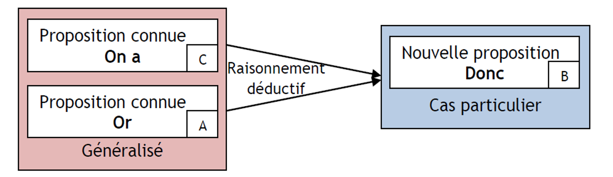

# Atelier 1: Les méthodes scientifiques

Une méthode scientifique est une démarche qui permet de répondre à une question en utilisant des données et des observations. Elle est basée sur l'observation, la répétabilité et la vérification des résultats.

## La démarche inductive

La démarche `inductive`, aussi appelée approche `empirico-inductive`, est une méthode de travail qui part de faits, de données brutes réelles et observables, pour aller vers l’explication de celles-ci.

À partir des phénomènes particuliers observés sur le terrain, le chercheur peut comprendre un phénomène général. On va du particulier au général.

La loi générale que l'on formule doit être vérfiée pour chacun des évènements préalables, mais elle peut à tout moment être démentie par un contre-exemple.

*Extrait de “[Le raisonnement en sciences de l’ingénieur”, JL Prensier, T. Zenard, 2006, ENS Cachan](https://eduscol.education.fr/sti/sites/eduscol.education.fr.sti/files/ressources/pedagogiques/6217/6217-le-raisonnement-en-sciences-de-lingenieur-ens.pdf)"*

#### Quelle est l’utilité de la démarche inductive dans le domaine académique ?

La démarche inductive est utile lorsque vous étudiez un sujet ou un phénomène connu. La démarche inductive permet aussi de :

- cerner son sujet de recherche ;
- définir les attentes de son enquête ;
- trouver les causes du phénomène étudié ;
- donner une explication à des effets observés ;
- Etablir une conclusion apportant des explications scientifiques sur le sujet ou sur le phénomène étudié.

#### Mener une démarche inductive en 4 étapes

La méthodologie de la démarche inductive se décompose en 4 étapes.

#### Analyser son sujet de travail

Avant de se lancer dans un travail inductif, il est important de bien analyser le sujet ou le phénomène étudié.

Pour cela, on doit se poser plusieurs questions :

- Le sujet ou le phénomène que j’étudie est-il observable ?
- Comporte-t-il des données chiffrées, brutes et/ou matériels ?
- Le phénomène est-il connu, réel ?

##### Exemple

**Sujet:** la baisse de la mortalité sur les routes en France.

**Données chiffrées:** 254 décès en novembre 2019 contre 268 en 2018.

**Données brutes:** recul du taux de mortalité de 5,2 %.

**Faits observables:** baisse du nombre de morts sur les routes françaises
    pour le troisième mois consécutif.

À partir de ce phénomène connu (la baisse de la mortalité
    sur les routes françaises), on cherchera à en comprendre les causes.

#### L’observation et l’enregistrement des faits

Après avoir vérifié que le sujet de l’étude peut bien coller avec la démarche inductive, on peut se lancer dans ses recherches.

L’intérêt est de comprendre les causes du phénomène ou du fait qu’il étudie.

Pour parvenir à obtenir des réponses, on peut se rendre sur le terrain, mener des observations, se documenter, et rencontrer des acteurs susceptibles de lui apporter des réponses (avec des entretiens par exemple).

##### Exemple

**Sujet:** la baisse de la mortalité sur les routes en France.

- Étudier les chiffres de la mortalité routière en France depuis le début des années 2000.
- Interroger un membre de la sécurité routière.
- Lire des rapports au sujet de la mortalité sur les routes en France.
- Étudier d’éventuelles corrélations : variation de la consommation d’alcool et de drogue en France.

#### Analyser des informations collectées

Après être allé sur le terrain pour récolter des informations, on peut désormais analyser les informations collectées.

Cette analyse doit permettre de faire émerger les causes du fait ou du phénomène qu’il étudie.

##### Exemple

**Sujet:** la baisse de la mortalité sur les routes en France.

À partir des informations et des faits relevés sur le terrain, deux éléments semblent être la cause expliquant le phénomène de la baisse de la mortalité sur les routes en France.

La sécurité renforcée dans les voitures: grâce à de nouveaux modèles de voitures, les technologies embarquées pour lutter contre les accidents et mieux protéger en cas d’accidents se sont fortement améliorées.

Les politiques publiques en termes de sécurité routière augmentent et s’intensifient depuis 10 ans (pose de nouveau radar, limitation de vitesse supplémentaire sur certains axes, passage aux 80 km/h sur les routes départementales, augmentation des contrôles routiers, augmentation des amendes).

#### La conclusion

La conclusion doit servir à l’étudiant de reprendre les arguments avancés afin d’expliquer les causes du phénomène ou du sujet étudié.

Il doit prouver avec des chiffres et des arguments fournis, les éléments qu’il avance.

##### Exemple

**Sujet:** la baisse de la mortalité sur les routes en France.

Le phénomène de baisse de la mortalité en France s’explique principalement par deux causes reliées l’une à l’autre par un facteur commun.

Tout d’abord, les politiques publiques menées en France depuis les années 90 ont permis de lutter efficacement contre la mortalité routière : la hausse des amendes, l’augmentation des limitations de vitesse, l’augmentation des contrôles routiers, et surtout, l’arrivée de la technologie des contrôles radars fixes sur les routes de France. Avec 4 700 appareils en activité, l’État français est parvenu à faire chuter le nombre de morts sur les routes de France. Avec près d’un milliard d’euros récoltés par an, l’État réinvesti 80 % de cette somme dans l’entretien des routes, ce qui permet d’éviter de nouveaux accidents causés par des infrastructures de mauvaise qualité.

La deuxième cause s’inscrit elle aussi sous la coupe de la technologie. Avec des véhicules intelligents qui embarquent des technologies toujours plus sophistiquées (nombre et performance des airbags, contrôle du dépassement des lignes blanches, contrôle des angles morts, système de freinage à distance, système ABS, appel d’urgence en cas de choc violent), le nombre de morts a fortement diminué.

Si le nombre de morts est passé de plus de 10 000 personnes en 1990 à environ 3 200 en 2018, cela s’explique en partie par la volonté de l’État de mettre en place d’avantages de mesures restrictives, bien aidés par le progrès de certaines technologies sur le bord des routes ou directement embarquées dans les voitures.

La démarche déductive s’avère utile pour mener un travail de recherche ou une enquête.

---

## La démarche déductive

La `méthode déductive`, aussi appelée `déduction logique` est une méthode de travail scientifique. Elle a pour but d’expliquer un phénomène en partant d’un sujet ou d’une hypothèse sur un phénomène. On ne part donc pas de faits observables (méthode inductive).

Les recherches entamées pour répondre à cette hypothèse permettent aussi au chercheur de développer d’autres hypothèses.

La confirmation ou la non-confirmation des hypothèses de travail doit permettre de trouver une explication au sujet ou au phénomène sur lequel se porte la recherche.

*Extrait de “[Le raisonnement en sciences de l’ingénieur”, JL Prensier, T. Zenard, 2006, ENS Cachan](https://eduscol.education.fr/sti/sites/eduscol.education.fr.sti/files/ressources/pedagogiques/6217/6217-le-raisonnement-en-sciences-de-lingenieur-ens.pdf)"*

> “La déduction sert aux économistes comme elle sert aux astronomes, aux physiciens, etc.
 D’un certain principe A, on déduit les conséquences B, C, D etc. ; celles-ci se trouvent vérifiées par l’observation ou par l’expérience, et c’est cette vérification qui rend probable A ; ce n’est pas le moins du monde A qui prouve B, C, D”. (Vilfred, 1984).

#### Exemples

- Socrate est un homme, or tout homme est mortel, donc Socrate est mortel.
- Le saumon est un poisson, or tout poisson vit dans l’eau, donc le saumon vit dans l’eau.
- La terre est un astre du système solaire, or tout astre du système solaire tourne autour du soleil, donc la terre tourne autour du soleil.

---

## La démarche abductive

Un `raisonnement par abduction`consiste, en observant un ou plusieurs faits `A1`, `A2`, `A3`, etc; dont on connaît une cause possible et la plus vraisemblable `B`, à prendre `B` comme hypothèse pour affirmer qu'elle est probablement la cause de `A1`, `A2`, `A3`, etc. en particulier.

#### Exemple

`S'il pleut alors je prends mon parapluie. J'ai pris mon parapluie` est un raisonnement abductif. En effet, on a observé que lorsque il pleut, on prend son parapluie. Cependant, on sait que l'on peut prendre son parapluie même s'il ne pleut pas.

On peut simplement dire qu'il pleut **probablement** par abduction.

---

## Résumé des 3 démarches

La démarche inductive est une méthode de travail scientifique qui consiste à partir de faits observables pour en déduire une hypothèse.

La démarche déductive est une méthode de travail scientifique qui consiste à partir d’une hypothèse pour en déduire des faits observables.

La démarche abductive est une méthode de travail scientifique qui consiste à déterminer la cause d’un phénomène à partir de lois générales.

| Induction        | Déduction         | Abduction |
|:-------------|:------------------|:------|
| Trouver une loi par généralisation d'observations / de corrélations particulières          | Déduire d'une conclusion à partir d’une loi/proposition considérée comme vraie| Poser la plausibilité d’une hypothèse à partir d’une loi / de constats |
| Socrate est un homme; Socrate est mortel; **Tous les hommes sont mortels** | Socrate est un homme; Tous les hommes sont mortels; **Socrate est mortel** | Tous les hommes sont mortels; Socrate est mortel; **Socrate est (plausiblement) un homme** |

## Démarche hypothético-déductive

En sciences expérimentales, la `démarche hypothético-déductive` est une façon de conduire la recherche qui associe **théorie** et **pratique** selon une séquence définie. 

#### 1. Observation / questionnement

On observe un fait. On se pose une question sur ce fait. 
La question doit pouvoir être répondue par l’intermédiaire d’observations concrètes.

#### 2. Élaboration d’une/des hypothèse(s) 

Une hypothèse est une réponse imaginaire, mais basée sur un raisonnement intelligent, pour la question posée. Une hypothèse doit être testable, vérifiable, potentiellement réfutable.

#### 3. Déduction de prédictions 

On prédit ce qui devrait arriver sous certaines conditions si l’hypothèse est valide.

#### 4. Définition d’expériences pour pouvoir tester les prédictions

On prédit ce qui devrait arriver sous certaines conditions si l’hypothèse est valide. On conçoit une/des expériences dont les conditions peuvent être créées de toute pièce en laboratoire ou sur le terrain ou en profitant des conditions créées par la nature (variations naturelles de l’environnement).

#### 5. Validation ou invalidation des prédictions (et donc hypothèses) par l’expérience

On exécute l’expérience, on recueille les données.
Si la prédiction ne se réalise pas, l’hypothèse est rejetée. 
Si la prédiction se réalise, l’hypothèse est supportée (du moins pour l’instant). 

#### 6. Communication des résultats à la communauté scientifique (voire à la société en général).

On publie les résultats dans des revues scientifiques, on les présente à des conférences, on les diffuse sur les réseaux sociaux, etc.
