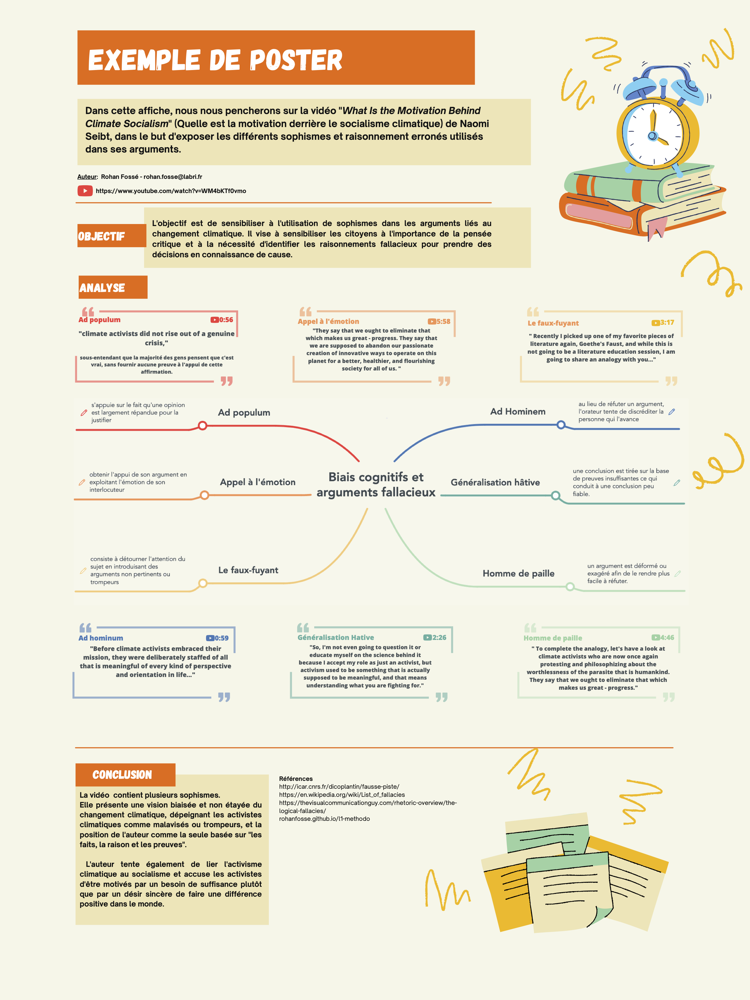
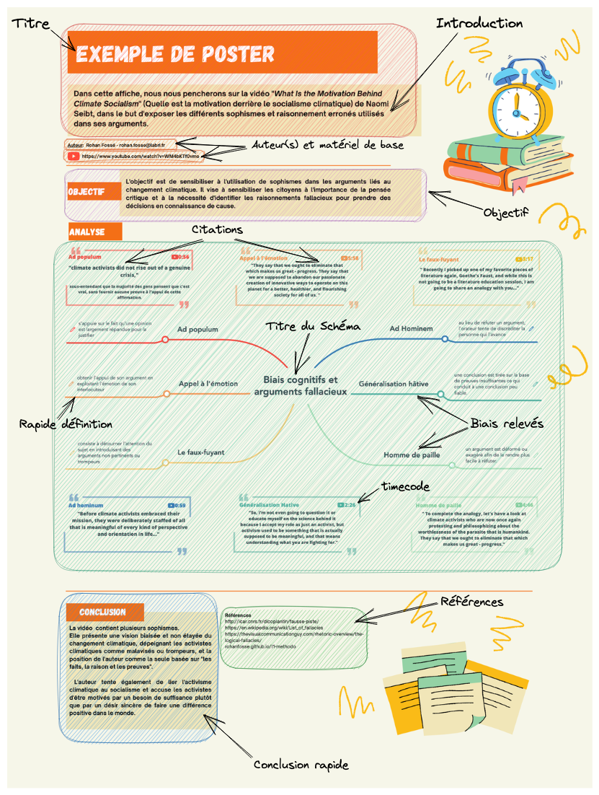

    [Retour au sommaire](README.md)

# Projet - Méthodologie Scientifique

---

**Page en cours de construction**

## Les ressources du projet

- [Les sujets du projets](fichiers/Cours_4TPU202U%20-%20Sujets%20de%20projets.pdf)
- [Les douzes mensonges du GIEC - Christian Gerondeau](fichiers/Les%20douze%20mensonges%20du%20GIEC%20_%20La%20religion%20-%20Christian%20Gerondeau.docx)
- [Transcription et Traduction Naomi Seibt - Models Predict Catastrophe - Climate of Freedom #4](fichiers/transcription-naomi-cof4.md)
- [Transcription et Traduction Naomi Seibt - Climate of Freedom: THE CONSENSUS FRAUD part 1](fichiers/transcription-naomi-1.md)
- [Transcription et Traduction Naomi Seibt - Climate of Freedom: THE CONSENSUS FRAUD part 2](fichiers/transcription-naomi-2.md)
- [Transcription et Traduction Naomi Seibt - What Is the Motivation Behind Climate Socialism](fichiers/transcription-naomi-motivation.md)

---

## La création du poster

Les slides du cours sont disponibles: [Slides Methodologie - Poster - Groupe B4](fichiers/Poster_methodologie_B4.pdf)

Le but n'est pas de critiquer les auteurs mais de mettre en avant les erreurs de raisonnements et les biais cognitifs.

### Quels outils utiliser pour créer le poster ?

Pour créer le poster, plusieurs solutions s'offrent à vous:

- [Word](https://www.microsoft.com/fr-fr/microsoft-365/word) ou son équivalent libre [LibreOffice](https://fr.libreoffice.org/)
- [Powerpoint](https://www.microsoft.com/fr-fr/microsoft-365/powerpoint)

Pour collaborer à plusieurs sur le même document, vous pouvez utiliser:

- [Canva](https://www.canva.com/fr_fr/)
- [Google Docs](https://docs.google.com/document/u/0/)
- [Google Slides](https://docs.google.com/presentation/u/0/)

Enfin, pour ceux qui le souhaitent, vous pouvez créer votre poster en LaTeX. Pour cela, vous pouvez utiliser [Overleaf](https://www.overleaf.com/).

### Quelques conseils pour la création du poster

- Le poster doit être clair et facile à lire
- Le poster doit être structuré
- Le poster doit être visuel
- Le poster doit être compréhensible par un public non spécialiste

### Exemple de poster

Vous pouvez télécharger le pdf du poster [ici](fichiers/Poster-Rohan-Naomi-v2.pdf)

#### Etude du poster

Décomposons le poster en plusieurs parties pour mieux comprendre comment il est structuré.

#### 1. Le titre

Le titre est important car il donne une première impression sur le sujet du poster. Il doit être clair et précis.

#### 2. L'introduction

L'introduction est la partie la plus importante du poster. Elle doit être claire et concise. Elle doit donner envie au lecteur de lire la suite du poster.

#### 3. Les auteurs du poster

N'oubliez pas de mettre vos noms et prénoms sur le poster. Vous pouvez aussi rajouter votre adresse mail et/ou votre groupe de travail.

#### 4. Les sources (les références)

Il est important de citer vos sources. Vous pouvez le faire en bas du poster.

---

## La présentation orale

