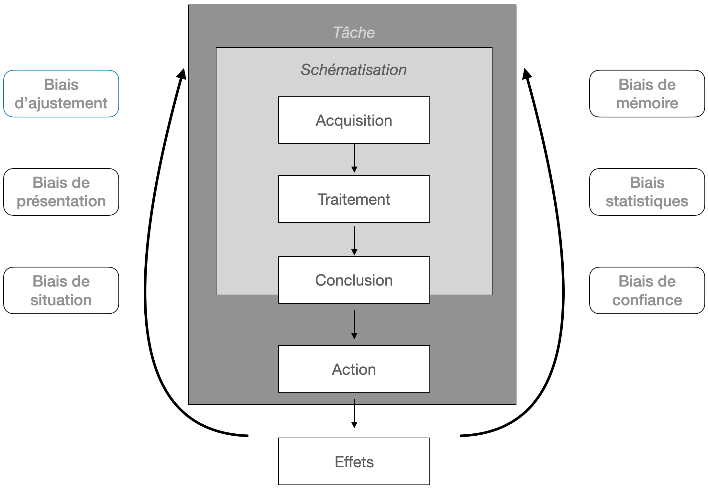

# Biais cognitifs et arguments fallacieux

Ce dossier contient diverses ressources (articles, références bibliographiques, diagrammes, ...) qui ont trait aux biais cognitifs.

On trouve nombre de documents décrivants certains biais adoptant des perspectives variés, allant de la psychologie sociale au marketing en passant par l'économie comportementale, etc.

Dans le contexte du cours, il importe de présenter une version simplifiée (surtout en nombre) des biais, sans négliger d'en donner une vision globale.

Le document (Arnott 1998), même si ancien, dresse un panorama complet des biais en apportant les références bibliographiques des travaux les ayant établis et étudiés. Il relate aussi des taxonomies de ces biais et en donne un vue diagrammatique intéressante qui les lie au processus de "traitement" de l'information, et des différents effets qu'ils produisent. La figure rend compte de cette interaction entre biais et phases de raisonnement (étendu au "jugement" ou évaluation qui engage ensuite une action, suivie d'effets, qui invitent éventuellement à revenir sur le processus d'évaluation).

L'article (Chattopadhyay 2020) est intéressant, et mérite peut-être d'être cité pour motiver l'étude des biais dans le champ informatique. Les auteurs font état d'une étude identifiant des biais cognitifs chez les développeurs menant à des erreurs de conception ou d'écriture du code.

## Références bibliographiques

David Arnott (1998). A Taxonomy of Decision Biases. Technical report 1/98. School of Information Management & Systems, Monash University.

Souti Chattopadhyay, Nicholas Nelson, Audrey Au, Natalia Morales, Christopher Sanchez, Rahul Pandita, and Anita Sarma (2020). A tale from the trenches: cognitive biases and software development. In Proceedings of the ACM/IEEE 42nd International Conference on Software Engineering (ICSE '20), 654–665. <https://doi.org/10.1145/3377811.3380330>