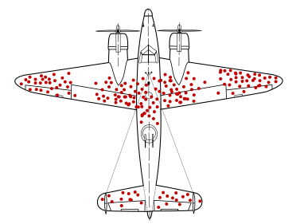

    [Retour au sommaire](../README.md)
    
        [Retour à l'Atelier 2](Atelier2.md)
    

# Liste des arguments fallacieux

Merci à [Alexandre Blanché](https://www.labri.fr/perso/ablanche/) pour son travail sur la création de cette liste.

## Arguments fallacieux formels

Les **arguments fallacieux formels** sont des arguments qui utilisent des règles de logique et de raisonnement erronées. En voici une liste non-exhaustive :

### Affirmation d’une disjonction  

On affirme que si une disjonction est vraie et que l’une de ses disjonctions est vraie, alors l’autre est forcèment fausse.

Si P ou Q vrai.

Par conséquent, Si Q est vrai, alors P est faux.

Pour faire la couverture du magazine Vogue, il faut être une célébrité ou être très belle.

La couverture de ce mois-ci était celle d'une célébrité.

Cette célébrité n'est donc pas très belle.

### Affirmation du conséquent 

L'affirmation du conséquent est un sophisme formel par lequel on considère une condition suffisante comme une condition nécessaire. On traite alors une implication logique comme si elle était une équivalence logique.

Si P est vrai, alors Q est vrai.

Par conséquent, si Q est vrai, alors P est vrai.

S'il a plu, alors le sol est mouillé.

Le sol est mouillé.

Donc il a plu.

Un tel raisonnement est invalide parce que le sol peut être mouillé pour une autre raison que la pluie, comme un arrosage. 

### Négation de l’antécédent 

La négation de l'antécédent, parfois également appelée erreur inverse ou sophisme de l'inverse, est un sophisme formel consistant à déduire l'inverse de l'énoncé d'origine. Elle est commise par des raisonnements de la forme :

Si P est vrai, alors Q est vrai.

Par conséquent, si P est faux, alors Q est faux.

Si vous êtes moniteur de ski, vous avez un travail.

Vous n'êtes pas moniteur de ski.

Vous n'avez donc pas de travail

<!-- Manque une source

### Sophisme existentiel

On suppose que si une catégorie existe, alors elle contient au moins un élément.

-->

### Mineure illicite

Tous les A sont B;

Tous les A sont C;

Donc, tous les B sont C.

Tous les chats sont mortels

Tous les chats sont des félins

Donc tous les mortels sont des félins.

### Majeure illicite

Tous les A sont B;

Aucun C n'est un A;  

Donc, aucun C n'est un B.

Tous les chats sont mortels;

Aucun homme n’est un chat;

Donc aucun homme n’est mortel.

### Appel à la probabilité 

Une proposition est supposée vraie parce qu’elle est très probable.

Quelque chose peut mal tourner (prémisse).

Par conséquent, quelque chose va mal se passer (conclusion invalide).

### Argument from fallacy (the fallacy fallacy) 

La conclusion d’un raisonnement est supposée fausse car le raisonnement qui mène à elle est fallacieux.

Si P, alors Q;

P est un argument fallacieux;

Par conséquent, Q est faux.

## Arguments fallacieux informels

Cette catégorie regroupe les arguments informels visant à convaincre ou persuader son auditoire via une utilisation erronée ou malhonnête du contenu ou du contexte des faits. En voici une liste non-exhaustive :

### Argument Ad hominem 

L'argument *Ad hominem* consiste à attaquer son adversaire sur la cohérence de ses propos en lui opposant ses propres paroles ou ses propres actions/

L'argument *ad hominem* est le 16e stratagème recensé par Arthur Schopenhauer dans son opuscule [La Dialectique éristique](https://fr.wikipedia.org/wiki/La_Dialectique_%C3%A9ristique) :

> Quand l’adversaire fait une affirmation, nous devons chercher à savoir si elle n’est pas d’une certaine façon, et ne serait-ce qu’en apparence, en contradiction avec quelque chose qu’il a dit ou admis auparavant, ou avec les principes d’une école ou d’une secte dont il a fait l’éloge, ou avec les actes des adeptes de cette secte, qu’ils soient sincères ou non, ou avec ses propres faits et gestes. Si par exemple il prend parti en faveur du suicide, il faut s’écrier aussitôt : « Pourquoi ne te pends-tu pas ? » Ou bien s’il affirme par exemple que Berlin est une ville désagréable, on s’écrie aussitôt : « Pourquoi ne prends-tu pas la première diligence ? » »

Bien que le Dr Barone plaide en faveur de la réduction de notre empreinte carbone, elle vit dans une grande maison et conduit un SUV.

### Appel à la pitié (et aux émotions en général) 

L'appel à la pitié est un sophisme consistant à obtenir l'appui de son argument en exploitant un sentiment de pitié ou de culpabilité chez son adversaire. L'appel à la pitié est une forme d'appel à l'émotion.

Mesdames et messieurs du jury, regardez cet homme misérable, dans un fauteuil roulant, incapable d'utiliser ses jambes. Un tel homme peut-il vraiment être coupable de détournement de fonds ?

### Appel à la nature / à la tradition 

L'appel à la nature est un argument dans lequel il est proposé qu'une chose est bonne parce qu'elle est **naturelle**, ou mauvaise parce qu'elle est **non naturelle**.

La cocaïne est entièrement naturelle ; elle est donc bonne pour la santé.

### Homme de paille 

La technique de l'homme de paille (ou de l'épouvantail) consiste à déformer la position de l'adversaire en lui attribuant un argument facilement réfutable.

« Vous ne voulez pas mettre au point ce programme de construction de porte-avions ; je ne comprends pas pourquoi vous voulez laisser notre pays sans défense. »

La proposition « je suis contre la construction d'un porte-avions » a été détournée en « je suis contre la défense de mon pays », argument beaucoup plus facile à mettre en défaut. 

### Appel à l’ignorance 

L'appel à l'ignorance est un raisonnement fallacieux dans lequel une proposition est déclarée vraie parce qu'elle n'a pas été démontrée fausse.

“La science ne peut pas prouver que Dieu n’existe pas / que les extraterrestres ne visitent pas la Terre.” (C’est un exemple de renversement de la charge de la preuve, exiger de son opposant qu’il prouve que ce que l’on affirme sans preuve est faux.)

### Confusion entre corrélation et causalité 

Le fait que deux variables soient corrélées n’implique pas que l’une est la cause de l’autre.

Exemple: Il existe une corrélation entre la vente de crème glacée et le nombre de morts par noyade. En réalité, ces deux phénomènes sont causés par une météo favorable.

### Cherry-picking 

Le **cherry picking** est un procédé de présentation des faits ou des données qui donnent du crédit à son opinion en passant sous silence les cas qui la contredisent. Ce procédé trompeur, pas nécessairement intentionnel, est typique des **biais de confirmation**.

Dans [une étude](https://ajp.psychiatryonline.org/doi/full/10.1176/appi.ajp.159.3.469) de 2002, l'examen de données médicales antérieures a permis de constater que les essais de médicaments antidépresseurs étaient entachés de discrimination :

> Les chercheurs ont examiné 31 essais d'efficacité d'antidépresseurs afin d'identifier les principaux critères d'exclusion utilisés pour déterminer l'éligibilité à la participation. Leurs conclusions suggèrent que les patients participant aux essais actuels sur les antidépresseurs ne représentent qu'une minorité des patients traités pour une dépression dans la pratique clinique courante. Selon les auteurs, l'exclusion de sujets potentiels d'essais cliniques présentant certains profils signifie que la capacité à généraliser les résultats des essais d'efficacité des antidépresseurs n'est pas étayée empiriquement.

### Biais du survivant 

Le biais des survivants est une forme de biais de sélection consistant à surévaluer les chances de succès d'une initiative en concentrant l'attention sur les sujets ayant réussi mais qui sont des exceptions statistiques (des « survivants ») plutôt que des cas représentatifs.

Au cours de la Seconde Guerre mondiale, le statisticien Abraham Wald a pris en compte le biais des survivants dans ses calculs afin d'évaluer comment minimiser la perte de bombardiers sous le feu ennemi. En étudiant les dommages causés à des aéronefs revenus de mission, l'étude a recommandé de blinder les endroits des appareils qui présentaient le moins de dommages. En effet, Wald a constaté que les études précédentes ne tenaient compte que des aéronefs qui avaient « survécu » à leur mission, sans tenir compte de ceux qui avaient disparu. Ainsi, les endroits endommagés des aéronefs revenus représentent les endroits où ces derniers peuvent encaisser des dommages et réussir à rentrer à la base. La conclusion de Wald est que lorsqu'un aéronef est endommagé à un autre endroit, il ne revient pas de sa mission. En conséquence, ce sont ces endroits - ceux non endommagés chez les « survivants » - qui devraient être renforcés, et non les endroits endommagés.

*Illustration of hypothetical damage pattern on a WW2 bomber. Based on a not-illustrated report by Abraham Wald (1943)*

### Généralisation abusive 

La généralisation abusive, aussi appelée généralisation hâtive, est une forme de sophisme qui consiste à tirer une conclusion générale à partir d’une expérience isolée ou d’un échantillon trop limité pour être significatif ou pertinent.

Les compagnies de tabac utilisaient ce type de sophisme pour expliquer que la consommation du tabac n'était pas la principale cause du cancer des poumons2. En effet, si le tabac intervient à un niveau statistique élevé dans les causes du cancer primaire du poumon (la plupart des malades sont fumeurs), la statistique inverse (quel pourcentage de fumeurs développent un cancer?) semble moins alarmante. En mettant en exergue certains cas particuliers où les personnes ne souffraient d'aucune maladie, et ce même après avoir consommé une grande quantité de tabac, ces compagnies ont affirmé que fumer des cigarettes était relativement inoffensif.

Source: [https://www.generationsanstabac.org/article/lobby-du-tabac-tres-actif-au-sein-de-la-commission-europeenne/](https://www.generationsanstabac.org/article/lobby-du-tabac-tres-actif-au-sein-de-la-commission-europeenne/)

### Fausse dichotomie 

La fausse dichotomie ou énumération incomplète, est un raisonnement fallacieux qui consiste à présenter deux solutions à un problème donné comme si elles étaient les deux seules possibles, alors qu'en réalité, il en existe d'autres.

Un argument courant contre les lois sur la pollution sonore consiste à faire un faux choix. On pourrait faire valoir qu'à New York, le bruit ne devrait pas être réglementé, car s'il l'était, un certain nombre d'entreprises seraient obligées de fermer leurs portes. Cet argument suppose que, par exemple, un bar doit être fermé pour éviter que des niveaux de bruit dérangeants n'en émanent après minuit. Cela ne tient pas compte du fait que la loi pourrait exiger du bar qu'il réduise ses niveaux sonores ou qu'il installe des éléments structurels insonorisants pour éviter que le bruit ne se transmette de manière excessive aux propriétés d'autrui.

Source: [https://eastvillage.thelocal.nytimes.com/2012/01/23/noise-complaints/](https://eastvillage.thelocal.nytimes.com/2012/01/23/noise-complaints/)

### Moving the goalpost 

*Moving the goalpost* est un sophisme informel qui consiste à rejeter les preuves présentées en réponse à une affirmation spécifique et à exiger d'autres preuves (souvent plus importantes).

Bob : Si l'évolution est réelle, montre-moi un exemple d'évolution en cours.
Suzy : Bien sûr. Il suffit de regarder l'augmentation des bactéries résistantes aux antibiotiques. Lorsque les antibiotiques sont utilisés, ils exercent une pression sélective qui élimine les bactéries sensibles et permet à celles qui sont résistantes de se développer de façon incontrôlée.
Bob : Non, cela ne compte pas. Montrez-moi un exemple qui se produit sur de longues périodes.

